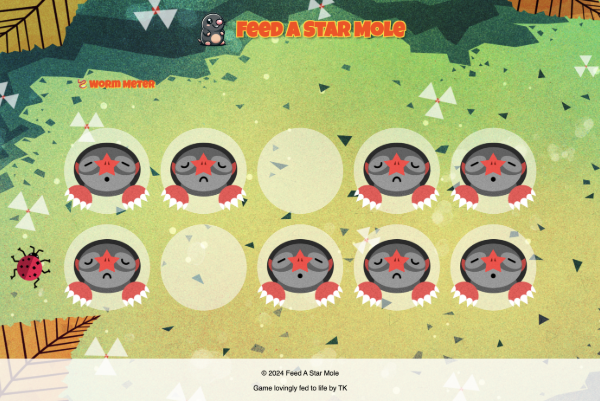

# Feed A Star Mole

Feed A Star Mole is a fun and interactive game where players aim to feed as many moles as possible. This project was developed as a final project for the Frontend Masters Bootcamp.

## Project Overview

In this game, players must click on moles that appear randomly in different states: hungry, sad, leaving, and gone. The goal is to feed the moles to earn points. The game ends when the player reaches a maximum score, triggering an end screen.



### Game Logic

- **Mole States**: Moles appear randomly but follow a specific order: hungry, sad, leaving, and gone.
- **State Transitions**:
  - Moles start as **hungry**, the only state where they can be fed.
  - If fed, the mole transitions to **fed**, then **leaving**, and finally **gone**.
  - If not fed, the mole transitions from **hungry** to **sad**, **leaving**, and **gone**.
  - After a random pause, the mole reappears as **hungry** and the cycle repeats.
- **Scoring**:
  - Regular moles give 1 point.
  - King moles (with crowns) appear 10% of the time and give 2 points.
- **Winning**: The game ends when the player reaches 10 or more points.
- **Worm Meter**: The worm meter at the top indicates the player's progress. It fills up as the score increases, becoming whole when the score hits 10.

## Features

- **Interactive Gameplay**: Click on the moles to feed them and earn points.
- **State Management**: Moles transition through different states based on time intervals.
- **Score Tracking**: The game keeps track of the player's score and displays a win screen when the maximum score is reached.
- **Smooth Animations**: Transitions for the worm meter progress is animated for a better user experience.

## Technologies Used

- HTML
- CSS
- JavaScript

## Getting Started

To get a local copy up and running, follow these steps:

### Installation

1. Clone the repository:
   ```bash
   git clone https://github.com/tak40/fm-bootcamp-feed-a-star-mole
   ```
2. Navigate to the project directory:
   ```bash
   cd fm-bootcamp-feed-a-star-mole
   ```
3. Open `index.html` in your preferred web browser.

## How to Play

1. Moles will appear in the holes in a random sequence.
2. Click on the hungry moles to feed them.
3. Each fed mole increases your score:
   - Regular moles give 1 point.
   - King moles give 2 points.
4. Fill the worm meter to the top by scoring 10 or more points to win the game.

## Acknowledgments

This project was developed as part of the [Frontend Masters Bootcamp](https://frontendmasters.com/bootcamp/).

## Links

- [Frontend Masters Bootcamp](https://frontendmasters.com/bootcamp/)
- [Course Link](https://frontendmasters.com/bootcamp/web-game-project/)
